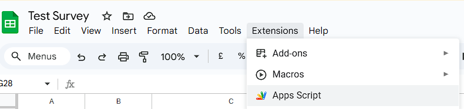
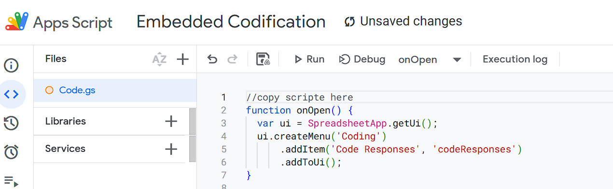
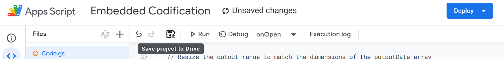
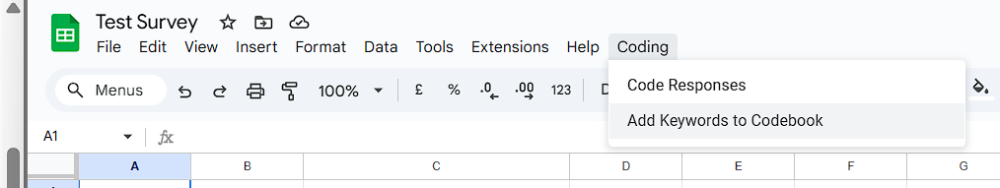

# 📄 External Codification Script (Google Sheets)

Automatically tag open-text survey responses using a shared, scalable keyword-based codebook stored in a separate Google Sheet.  
This version allows you to maintain a large, reusable codebook across multiple projects without editing the script.

---

## ⚡ What This Script Does

- Adds a **"Coding"** menu to your Google Sheet.
- Lets you select a column of responses to analyze.
- Matches responses against a keyword-based **external codebook** (stored in another Google Sheet).
- Outputs matching category codes in the adjacent column.
- Allows you to **add new keywords directly via prompt**, with validation to prevent duplicates.

---

## 🛠️ How to Set It Up

### 1. Prepare Your Codebook Sheet

You’ll need a separate Google Sheet with a tab named `Codebook`. It should have at least these two columns:

| A (Code) | B (Keyword)        |
|----------|--------------------|
| PIC      | payment failure    |
| WS       | unstable website   |
| ...      | ...                |

Optionally, you can add full category names in columns D and E like so:

| D (Code Name)        | E (Abbreviation) |
|----------------------|------------------|
| Website Stability    | WS               |
| Payment Issues       | PIC              |

These help populate dropdowns when adding new keywords.

---

### 2. Copy the Script

1. Open the Google Sheet where you want to run the script.
2. Go to: Extensions → Apps Script



3. Paste the contents of `external-codification.gs` into the script editor.



4. Link the External Codebook:

Example URL:

```js
https://docs.google.com/spreadsheets/d/1a2b3cD4EFghiJK5lmNOPqrS67tuVWXYZ/edit#gid=0
                                       ^^^^^^^^^^^^^^^^^^^^^^^^^^^^^^
```

```js
var spreadsheetId = '[Replace with your spreadsheet ID located inside the URL]';
```

with:

```js
var spreadsheetId = '1a2b3cD4EFghiJK5lmNOPqrS67tuVWXYZ';
``` 

5. Save and close the editor.



6. Reload Your Google Sheet



---

## 🧪 How to Use It
Highlight the column with open-text responses.

1. Go to Coding → Code Responses.
2. When prompted, enter how many rows to process (up to the total number in your sheet).
3. The script will:
  - Match each response against the keywords in your external codebook.
  - Return the first matching code.
  - Write the result in the column to the right.

---

## ➕ Add New Keywords to Codebook


This feature lets you expand your codebook directly from the Google Sheet — without editing the sheet manually.

When you select **`Coding → Add Keywords to Codebook`** from the menu, here's what happens:

### 🧩 Step-by-Step

1. **Choose a Category**  
   A prompt appears with available codes (e.g., `WS`, `PIC`, `DP`).  
   These are pulled from columns **D (Code Name)** and **E (Abbreviation)** in your Codebook sheet.

2. **Enter Keywords**  
   You’ll be asked to input one or more keywords (comma-separated).  
   Example: slow checkout, confusing navigation, login issues

3. **Validation Check**  
- The script checks existing keywords to **prevent duplicates**.
- If any keyword is already used under any category, you'll be notified, and those duplicates will be skipped.

4. **Append to Codebook**  
All valid new keywords are automatically added to the next available row in the Codebook sheet under the selected code.

5. **Confirmation**  
Once added, a pop-up confirms successful insertion.

---

## ✅ Example Codebook Entries
| Code | Keyword               |
|------|------------------------|
| WS   | site crashes           |
| DP   | discount not applied   |
| PIC  | payment failed         |
| PS   | size guide missing     |

---

## 📌 Notes and Tips
- Matching is case-insensitive and uses full-word matching (\b word boundaries).
- Only the first matching code is returned for each response.
- If no match is found, the output cell is left blank.
- The keyword list can be easily expanded through the UI or directly in the codebook Sheet.

---

## 🔐 Permissions Required
When first run, the script will ask for authorization to:
- Read/write the current spreadsheet (responses)
- Access the external Codebook spreadsheet (via ID)
These are required to read your keyword data and write codified responses.

---

## 🖼️ Visual Guide

### 📎 Included Codebook Template

You can find a working codebook template in this repository:

📄 [Codebook Database.xlsx](./Codebook%20Database.xlsx)

To use it:
- Open it in Google Sheets
- Rename the tab to `Codebook` (if not already)
- Copy the **spreadsheet ID** from the URL
- Paste it into your script as shown above


